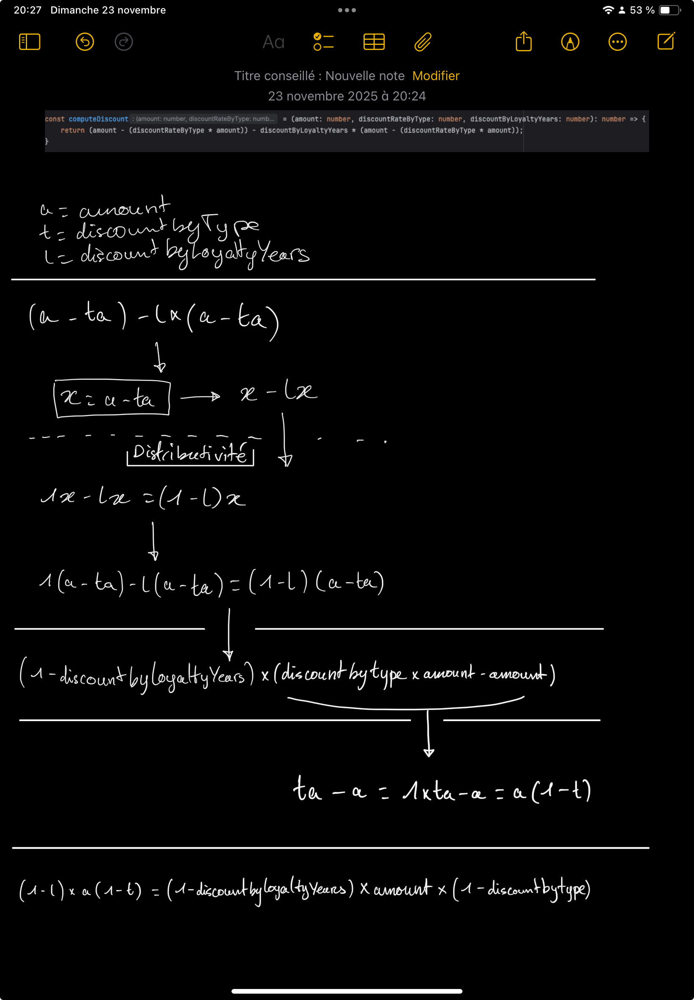

# Front-end JavaScript algorithm

## Instructions

Simplifier / refactoriser la fonction dans le fichier pricing.js

## Synthèse
J'ai commencé par analyser le code et je me suis vite rendu compte qu'il y avait un assert en dessous de la fonction `calculateDiscount` et que cet assert semblait s'attendre à un comportement auquel `calculateDiscount` ne semblait pas répondre.
En effet, en cas de `type 1`, `calculateDiscount` renvoyait directement le montant d'origine.

N'ayant pas de PO vers qui me tourner, pour en savoir plus sur le besoin metier, j'ai décidé de garder cette reflexion pour plus tard et de me concentrer premièrement sur la refacto. 

### Refacto
Afin de refactoriser le code de la fonction originelle `calculateDiscount`, j’ai suivi une approche classique de refactorisation sur code legacy :

#### 1. Écriture des tests de caractérisation et installation de typescript
Avant de toucher au code, j'ai préféré me sécuriser en écrivant des **tests de caractérisation**, ceux-ci me permettant de me **prémunir d'éventuelles régressions**. J'ai par conséquent installé **Jest**.
Pour des questions de **confort** dans un premier temps et de **consolidation du code** dans un second, j'en ai profité pour installer **TypeScript**

#### 2. Décomposition et factorisation du calcul
Le code initial se résumait en une fonction monolithique avec plusieurs petit hics : 
- la fonction portait toute la logique en son sein **SRP**
- des ifs imbriqués
- du duplicate content (notamment dans les calculs)
- plusieurs formules différentes pour un même calcul
- des assignations de variables non déclarées (variables implicitement globales)
- des magic valeurs "inline" dans le code (magic numbers) 
- aucune gestion des valeurs invalides (exemple: on renvoie un montant à 0 avec un mauvais type de réduction)

J’ai donc effectué une refactorisation progressive en plusieurs étapes que l'on peut suivre en consultant [l'historique des commits](https://github.com/Alex100dre/fd-test/commits/main/). 
Mais globalement la refacto peut se résumer en cette liste d'actions :

- Typage
- Suppression des magic numbers via l'utilisation d'enums, constantes et objets de mapping
- Découpage de la logique en sous-fonctions distinctes et réutilisables
- Harmonisation des formules mathématiques puis factorisation de celles-ci
- Ajout d'une fonction pour arrondir le montant retourner à 2 décimales car [certains montants dérivaient loin après la virgule](https://www.robinwieruch.de/javascript-rounding-errors/#:~:text=Rounding%20errors%20are%20a%20common,is%20not%200.3%20but%200.30000000000000004%20.) 

Bien entendu, chacune des fonctions créees a été prédédée par l'écriture de tests unitaires visant exprimer le besoin et à vérifier que le code écrit réponde bien à celui-ci.

#### Raisonnement de la factorisation mathématique


#### Rédaction de la documentation
J'ai éstimé qu'il serait intéressant de documenter la logique implémentée. J'ai donc documenté chaque fonction via JSDOC.

#### Correction des bugs
Une fois la refactorisation terminée, je me suis de nouveau penché sur cette histoire d'assert en fin de fichier. 
Partant du principe qu'il n'avait pas été rédigé pour rien, et que le console.warn qui s'affiche à chaque lancement des tests était là pour faire comprendre qu'il s'agissait d'une partie de l'exercice. 
J'ai pris parti d'interpréter la contradiction dans le code comme un bug et de le corriger.

J'ai toute fois, laisser un commentaire "TODO" pour résumer la situation. (C'est ce que j'aurais fais dans un contexte de mission le temps d'avoir la reponse coté métier).

```js
// pricing.ts:110
// TODO : J'ai supprimé le contrôle qui renvoyait le montant sans remise pour le type Bronze. Car ce bout de code laisse à penser que ce n'est pas le comportement attendu (à valider)
```

#### Pistes d'amélioration
J'ai laissé d'autres commentaires du même genre pour toutes les incertitudes que j'ai eu et les évolutions possibles que j'ai pu remarquer. 
(Je ne sais pas à quel moment l'exercice s'arrête et ayant un emploi du temps chargé, j'ai préféré relever les points ambigus plutôt que de les traiter potentiellement pour rien)

```js
// pricing.ts:38
// TODO: Il va certainement falloir ajouter des exceptions ou autre au lieu de renvoyer 0 car ça n'a pas de sens d'avoir un article gratuit si on envoie un mauvais type de reduc

// pricing.test.ts:255
// TODO: On devrait certainement gérer des exception car une reduction ne devrait pas être négativve et augmenter le prix

//pricing.ts:42
// TODO: On pourrait storer l'amount en entier de centimes plutot que des euros à virgule (cf: https://www.robinwieruch.de/javascript-rounding-errors/#:~:text=Rounding%20errors%20are%20a%20common,is%20not%200.3%20but%200.30000000000000004%20.)
// "Everyone who works in finance and web/software development knows that monetary values should be stored as integers (cents) and not as floating-point numbers (dollar) in the database."
```

